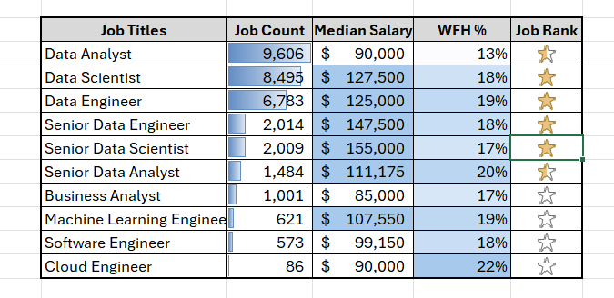

## Project Preview

# ExcelFormatting
# Excel Formatting Project

## Download Excel File

[Download the Excel Project](project-files/Excel-Data-Science-Dashboard.xlsx)

## Overview

The goal of the project was to transform raw job listing data into a clean, 
automated, and visually structured analytical report.

---

## Features

- Conditional formatting (heatmap-style highlights)
- Sparklines for monthly trend visualization
- Data bars and icon-based KPI indicators
- Aggregated yearly report
- Dashboard-style layout

---

## Data Analysis

The dashboard analyzes:

- Monthly job demand (Jan–Dec)
- Job count by role
- Median salary comparison
- Work-from-home percentage
- Custom ranking metric

---

## Skills Demonstrated

- Conditional formatting techniques
- Data visualization in Excel
- Clean dashboard design principles

---

## Learning Source

This project was developed while completing the course:

**Microsoft Excel – Excel from Beginner to Advanced**  
by Kyle Pew (Office Newb)

While following the core concepts from the course, 
the final dashboard and automation logic were implemented independently.

